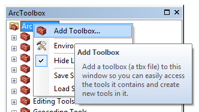
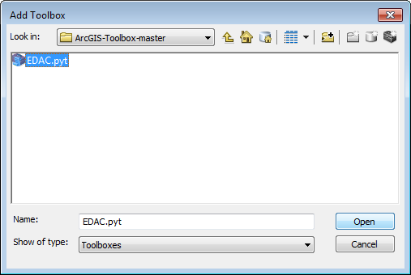

# EDAC ArcGIS Toolbox

The EDAC toolbox is a collection ArcGIS tools that you might find usefull.

Current Tools
  - Initial Building Objects

### Installation
Download and unzip the github repo.
https://github.com/edac/ArcGIS-Toolbox/archive/master.zip

Open ArcMap and right click on "ArcToolbox", and click "Add Toolbox..."

Browse to the location of the now unziped repository and choose the EDAC.pyt

Thats it! 

### Development
The toolbox was developed at the Earth Data Analysis Center at the University of New Mexico.

License
----

MIT
